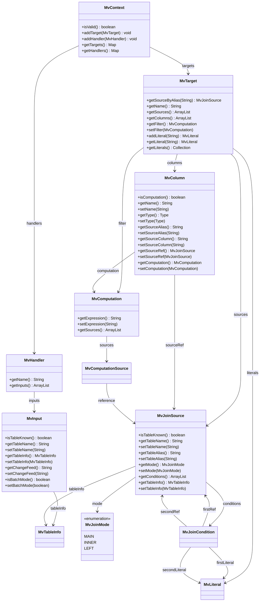

# YDB Materializer Development Guide

## Архитектурные заметки

Основные компоненты:
1. Модель данных для описания материализованного представления
2. Парсер конфигурационного формата
3. Валидатор конфигурации (+ загрузчик метаданных)
4. Распределенный планировщик для управления заданиями
5. Задание интерактивной обработки потоков изменений табличных данных
6. Задание пакетного применения изменений справочников к конкретной MV
7. Задание полной перезагрузки данных MV

### Модель данных

Более-менее готова, описана ниже в разделе "Model Classes UML Diagram". Модификации при выявлении недоделок и новых потребностей.

### Парсер конфигурационного формата

Готов, изменения при выявлении необходимых модификаций модели данных. Основан на грамматике ANLRv4.

### Валидатор конфигурации

Реализована загрузка конфигурации (псевдо-SQL-операторов) из файла и из таблицы и подача в парсер, с последующим вызовом валидатора. Валидатор включает несколько последовательно запускаемых фаз, при выявлении на очередной фазе критических ошибок дальнейшая обработка не производится.

Реализована загрузка описаний таблиц БД и привязка этих описаний к соответствующим сущностям.

Частично реализована валидация, недоделки:
- проверка состава колонок и типов данных MV
- нет автомата проверки синтаксической корректности генерируемых запросов
- корректных методов доступа при соединении таблиц в различных ситуациях

### Распределенный планировщик для управления заданиями

Планирую задействовать [db-scheduler](https://github.com/kagkarlsson/db-scheduler). Для этого требуется обеспечить работу поверх YDB (отдельный проект), за основу смотрю реализацию для JDBC (встроенный вариант) и для MongoDB.

Над стандартным планировщиком нужна надстройка, обеспечивающая запуск, остановку и контроль состояния заданий в прикладных терминах.

### Задание интерактивной обработки потоков изменений табличных данных

TODO

### Задание пакетного применения изменений справочников к конкретной MV

TODO

### Задание полной перезагрузки данных MV

TODO

## Model Classes UML Diagram

This diagram shows the relationships between all classes in the `tech.ydb.mv.model` package.

## Class Descriptions

### Core Classes

- **MvContext**: Root container that holds materialized view targets and handlers; provides a validity check
- **MvHandler**: Processing context that groups multiple inputs (changefeed streams)
- **MvTarget**: A materialized view definition with join sources, output columns, optional filter, and de-duplicated literals
- **MvInput**: An input table configuration with optional changefeed and discovered `MvTableInfo`; supports batch mode
- **MvJoinSource**: A table participating in a join with alias, join mode, conditions, and optional `MvTableInfo`
- **MvJoinMode**: Enumeration of join modes (`MAIN`, `INNER`, `LEFT`)
- **MvJoinCondition**: A join predicate side-by-side specification using aliases/columns and/or literals
- **MvColumn**: Output column mapping from a source or a computation; includes output type
- **MvComputation**: A computed expression with a list of source aliases (each may reference a `MvJoinSource`)
- **MvTableInfo**: Table metadata (columns, primary key, indexes, changefeeds)
- **MvLiteral**: An immutable literal value identified within a target and reused across conditions/expressions

### Key Relationships

1. **MvContext** holds all materialized view targets and handlers
2. **MvHandler** aggregates multiple **MvInput** entries
3. **MvTarget** contains **MvJoinSource** items (sources), **MvColumn** items (columns), optional **MvComputation** (filter), and manages **MvLiteral** values
4. **MvInput** links to discovered **MvTableInfo** metadata
5. **MvJoinSource** owns **MvJoinCondition** items, has a **MvJoinMode**, and may link to **MvTableInfo**
6. **MvColumn** references either a **MvJoinSource** (sourceRef) or a **MvComputation** (computation)
7. **MvComputation** has multiple sources; each computation source may reference a **MvJoinSource**
8. **MvJoinCondition** can reference two **MvJoinSource** sides and/or **MvLiteral** values
