# YDB Materializer Development Guide

## Model Classes UML Diagram

This diagram shows the relationships between all classes in the `tech.ydb.mv.model` package.

```mermaid
classDiagram
    class MvPositionHolder {
        <<interface>>
        +getInputPosition() MvInputPosition
    }

    class MvContext {
        -ArrayList views
        -ArrayList inputs
        -ArrayList errors
        -ArrayList warnings
        +isValid() boolean
        +addIssue(MvIssue) void
        +getViews() ArrayList
        +getInputs() ArrayList
        +getErrors() ArrayList
        +getWarnings() ArrayList
    }

    class MvTarget {
        -String name
        -ArrayList sources
        -ArrayList columns
        -MvComputation filter
        -MvInputPosition inputPosition
        +MvTarget(MvInputPosition)
        +getSourceByName(String) MvTableRef
        +getName() String
        +setName(String)
        +getSources() ArrayList
        +getColumns() ArrayList
        +getFilter() MvComputation
        +setFilter(MvComputation)
        +getInputPosition() MvInputPosition
        +setInputPosition(MvInputPosition)
        +toString() String
    }

    class MvInput {
        -String tableName
        -MvTableRef tableRef
        -String changeFeed
        -boolean batchMode
        -MvInputPosition inputPosition
        +MvInput(MvInputPosition)
        +getTableName() String
        +setTableName(String)
        +getTableRef() MvTableRef
        +setTableRef(MvTableRef)
        +getChangeFeed() String
        +setChangeFeed(String)
        +isBatchMode() boolean
        +setBatchMode(boolean)
        +getInputPosition() MvInputPosition
        +setInputPosition(MvInputPosition)
    }

    class MvTableRef {
        -String reference
        -String alias
        -Mode mode
        -ArrayList conditions
        -MvInputPosition inputPosition
        +MvTableRef(MvInputPosition)
        +getReference() String
        +setReference(String)
        +getAlias() String
        +setAlias(String)
        +getMode() Mode
        +setMode(Mode)
        +getConditions() ArrayList
        +getInputPosition() MvInputPosition
        +setInputPosition(MvInputPosition)
    }

    class MvTableRefMode {
        <<enumeration>>
        MAIN
        INNER
        LEFT
    }

    class MvColumn {
        -String name
        -String sourceAlias
        -String sourceColumn
        -MvTableRef sourceRef
        -MvComputation computation
        -MvInputPosition inputPosition
        +MvColumn(MvInputPosition)
        +isComputation() boolean
        +getName() String
        +setName(String)
        +getSourceAlias() String
        +setSourceAlias(String)
        +getSourceColumn() String
        +setSourceColumn(String)
        +getSourceRef() MvTableRef
        +setSourceRef(MvTableRef)
        +getComputation() MvComputation
        +setComputation(MvComputation)
        +getInputPosition() MvInputPosition
        +setInputPosition(MvInputPosition)
    }

    class MvComputation {
        -ArrayList sources
        -String expression
        -MvInputPosition inputPosition
        +MvComputation(MvInputPosition)
        +getExpression() String
        +setExpression(String)
        +getSources() ArrayList
        +getInputPosition() MvInputPosition
        +setInputPosition(MvInputPosition)
    }

    class MvComputationSource {
        -String alias
        -MvTableRef reference
        +Source(String)
        +Source(String, MvTableRef)
        +getAlias() String
        +setAlias(String)
        +getReference() MvTableRef
        +setReference(MvTableRef)
    }

    class MvJoinCondition {
        -String firstLiteral
        -MvTableRef firstRef
        -String firstAlias
        -String firstColumn
        -String secondLiteral
        -MvTableRef secondRef
        -String secondAlias
        -String secondColumn
        -MvInputPosition inputPosition
        +MvJoinCondition(MvInputPosition)
        +getFirstLiteral() String
        +setFirstLiteral(String)
        +getFirstRef() MvTableRef
        +setFirstRef(MvTableRef)
        +getFirstAlias() String
        +setFirstAlias(String)
        +getFirstColumn() String
        +setFirstColumn(String)
        +getSecondLiteral() String
        +setSecondLiteral(String)
        +getSecondRef() MvTableRef
        +setSecondRef(MvTableRef)
        +getSecondAlias() String
        +setSecondAlias(String)
        +getSecondColumn() String
        +setSecondColumn(String)
        +getInputPosition() MvInputPosition
        +setInputPosition(MvInputPosition)
    }

    class MvInputPosition {
        -int line
        -int column
        +MvInputPosition(int, int)
        +getLine() int
        +getColumn() int
    }

    class MvIssue {
        <<interface>>
        +isError() boolean
        +getMessage() String
        +getPosition() MvInputPosition
    }

    class MvIssueIssue {
        <<abstract>>
        -MvInputPosition mip
        +Issue(MvInputPosition)
        +getPosition() MvInputPosition
    }

    class MvIssueError {
        <<abstract>>
        +Error(MvInputPosition)
        +isError() boolean
    }

    class MvIssueWarning {
        <<abstract>>
        +Warning(MvInputPosition)
        +isError() boolean
    }

    class MvIssueUnknownAlias {
        -MvTarget target
        -String aliasName
        +UnknownAlias(MvTarget, String, MvPositionHolder)
        +getMessage() String
    }

    MvPositionHolder <|.. MvTarget : implements
    MvPositionHolder <|.. MvInput : implements
    MvPositionHolder <|.. MvTableRef : implements
    MvPositionHolder <|.. MvColumn : implements
    MvPositionHolder <|.. MvComputation : implements
    MvPositionHolder <|.. MvJoinCondition : implements

    MvContext --> MvTarget : contains
    MvContext --> MvInput : contains
    MvContext --> MvIssue : contains

    MvTarget --> MvTableRef : sources
    MvTarget --> MvColumn : columns
    MvTarget --> MvComputation : filter

    MvInput --> MvTableRef : tableRef

    MvTableRef --> MvJoinCondition : conditions
    MvTableRef --> MvTableRefMode : mode

    MvColumn --> MvTableRef : sourceRef
    MvColumn --> MvComputation : computation

    MvComputation --> MvComputationSource : sources
    MvComputationSource --> MvTableRef : reference

    MvJoinCondition --> MvTableRef : firstRef
    MvJoinCondition --> MvTableRef : secondRef

    MvIssue <|-- MvIssueIssue
    MvIssueIssue <|-- MvIssueError
    MvIssueIssue <|-- MvIssueWarning
    MvIssueError <|-- MvIssueUnknownAlias

    MvTarget --> MvInputPosition : inputPosition
    MvInput --> MvInputPosition : inputPosition
    MvTableRef --> MvInputPosition : inputPosition
    MvColumn --> MvInputPosition : inputPosition
    MvComputation --> MvInputPosition : inputPosition
    MvJoinCondition --> MvInputPosition : inputPosition
```

## Class Descriptions

### Core Classes

- **MvPositionHolder**: Interface implemented by all model classes to provide position tracking for error reporting
- **MvContext**: The main container class that holds all materialized view definitions, inputs, and validation issues with issue management
- **MvTarget**: Represents a materialized view target with its sources, columns, and optional filter, includes source lookup functionality
- **MvInput**: Represents an input table with optional change feed configuration
- **MvTableRef**: Represents a table reference in joins with its alias and join mode
- **MvColumn**: Represents a column definition, either from a source or computed, with enhanced source reference tracking
- **MvComputation**: Represents computed expressions with their sources
- **MvJoinCondition**: Represents join conditions between tables
- **MvInputPosition**: Tracks the position in the input for error reporting
- **MvIssue**: Interface for validation errors and warnings with position tracking

### Issue Management Classes

- **MvIssue.Issue**: Abstract base class for all issues with position tracking
- **MvIssue.Error**: Abstract base class for error-type issues
- **MvIssue.Warning**: Abstract base class for warning-type issues
- **MvIssue.UnknownAlias**: Concrete error implementation for unresolved alias references

### Key Relationships

1. **MvPositionHolder** is implemented by all model classes for consistent position tracking
2. **MvContext** is the root container that holds all materialized view definitions and manages issue collection
3. **MvTarget** represents individual materialized views with enhanced source lookup capabilities
4. **MvTableRef** represents table references in joins with their conditions
5. **MvColumn** can reference either a source column or a computation, with enhanced source reference tracking
6. **MvComputation** can have multiple sources and represents computed expressions
7. **MvIssue** provides a comprehensive hierarchy for error and warning reporting with position tracking
8. All model classes implement **MvPositionHolder** for consistent error reporting 